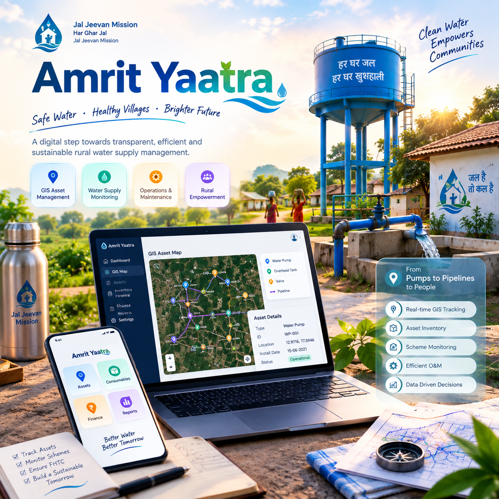

# Amrit Yatra

Amrit Yatra is a water-supply grievance and tracking portal. Citizens can report water-related
issues (no supply, contamination, low pressure, pipe leakage, billing problems), track a
complaint's status with a unique code, and report emergencies. Government officials get a
dashboard to review, filter, and resolve every complaint submitted across the system.

The app is a single-page Angular application talking directly to Supabase (Postgres + Auth) —
there is no custom backend server, no Flask, and no local database file. Every read and write
goes straight from the browser to Supabase, secured by Row Level Security (RLS) policies rather
than server-side application code.

## Why it was rebuilt this way

The original version of this project was a Flask + SQLite app with server-rendered HTML
templates, a hand-rolled bcrypt login system, and a hardcoded government-credential dictionary.
This rewrite replaces all of that with:

- A real, extensible auth system (Supabase Auth) instead of a hardcoded admin list
- A single Angular codebase instead of Flask routes + Jinja templates + vanilla JS
- Declarative, auditable access control (Postgres RLS + security-definer functions) instead of
  ad-hoc `if` checks inside route handlers
- A component-based, reusable UI instead of duplicated HTML across pages

## Stack

- **Frontend:** Angular 19 — standalone components, functional route guards (`CanActivateFn`),
  reactive forms, signals for local UI state
- **Styling:** Tailwind CSS utilities + hand-written SCSS for gradients, glassmorphism, and
  micro-interactions
- **Backend:** [Supabase](https://supabase.com) — Postgres database, Row Level Security, Auth,
  and RPC functions for the pieces that need to run with elevated privilege (public tracking,
  public stats)
- **Data access:** `@supabase/supabase-js` v2, used directly from Angular services — no REST
  layer, no server, no ORM

## Features

| Area | Description |
| --- | --- |
| Citizen accounts | Registration and login via Supabase Auth, profile row auto-created with `role = 'citizen'` |
| Government accounts | Same auth system; a dedicated `/gov-login` route checks `role = 'government'` on the profile before granting dashboard access |
| Complaint submission | Anonymous or logged-in; generates a unique 6-character tracking code client-side with retry-on-collision |
| Complaint tracking | Public, no login required — looks up a complaint by code via a security-definer RPC that only exposes non-sensitive fields |
| Emergency reporting | Same form, pre-locked to urgent issue types, styled with more visual urgency |
| Water status page | Public aggregate stats (totals, active/resolved counts, no-supply count) via a public RPC |
| Citizen dashboard | Personal complaint history and quick actions, gated by `authGuard` |
| Government dashboard | Stat cards + full complaints table with inline status updates, gated by `authGuard` + a role check |

## Project structure

```
src/app/
  core/
    supabase.service.ts   Singleton wrapping the Supabase client: auth, profile, complaint CRUD, stats
    guards.ts             authGuard and roleGuard(role) functional route guards
    models.ts             Shared TypeScript interfaces (Profile, Complaint, etc.)
  shared/
    components/
      topbar/              Brand, notifications, user menu, logout
      sidebar/              Collapsible, role-aware navigation
      stat-card/            Reusable metric tile with gradient accent
      status-badge/         Colored pill per complaint status
      card/                 Glassmorphic panel shell
      complaint-form/       Reusable form used by both /complaint and /report-emergency
    layouts/
      public-layout/        Topbar + footer wrapper for public pages
      dashboard-layout/     Topbar + sidebar + router-outlet wrapper for authenticated pages
  features/
    home/, about/                        Public marketing/info pages
    auth/login/, auth/register/, auth/gov-login/   Authentication flows
    complaint/, report-emergency/        Complaint submission
    track-complaint/, view-complaint/    Complaint lookup
    water-status/                        Public aggregate stats
    dashboard/                           Citizen dashboard
    gov-dashboard/                       Government dashboard
```

## Database schema (Supabase)

| Table / function | Purpose |
| --- | --- |
| `amrit_profiles` | One row per auth user: `id` (FK to `auth.users`), `name`, `role` (`citizen` \| `government`) |
| `amrit_complaints` | Complaint records: contact info, issue, details, tracking `code`, `status` |
| `amrit_is_government()` | Security-definer helper used inside RLS policies to check the caller's role |
| `amrit_track_complaint(code)` | Public RPC returning only `code`, `issue`, `status`, `complaint_date`, `created_at` for anonymous tracking |
| `amrit_public_stats()` | Public RPC returning aggregate counts for the water-status page |

Row Level Security ensures:

- Citizens can only `SELECT`/`UPDATE` their own `amrit_profiles` row
- Anyone can `INSERT` a complaint (anonymous submission is allowed, matching the original app)
- Citizens can only `SELECT` complaints they own (`user_id = auth.uid()`)
- Government accounts can `SELECT` and `UPDATE` every complaint
- Anonymous visitors never query the tables directly — only through the two RPC functions, which
  intentionally expose a narrower set of fields

## Getting started

```bash
npm install
npm start        # ng serve, http://localhost:4200
npm run build    # production build to dist/amrit-yatra
```

Supabase connection details live in `src/environments/environment.ts` and
`environment.development.ts`. The values there are the project URL and the **publishable/anon
key**, which is safe to ship in client-side code by design — all real access control happens in
Postgres via RLS, not by keeping that key secret.

## Creating a government account

Public registration (`/register`) always creates a `citizen` profile — there is no self-service
way to become a government user, by design. To promote an account:

1. Register normally through the app with the email you want to use as a government login.
2. In the Supabase dashboard (or via SQL), update that user's role:

   ```sql
   update public.amrit_profiles
   set role = 'government'
   where id = (select id from auth.users where email = 'you@example.com');
   ```
3. Log in at `/gov-login` with that same email and password.

## Security notes

- No credentials, API secrets, or `.env` files are committed to this repository. The only key in
  source is the Supabase publishable/anon key, which is meant to be public and is constrained by
  RLS on every table.
- Never commit a Supabase **service role** key to this project — it bypasses RLS entirely and
  must only ever live in a secure server-side environment, which this app intentionally does not
  have.

## Testing this build

Once you have a citizen and a government account (see above), a full smoke test looks like:

1. Visit `/` and `/about` — public pages should load with no console errors.
2. Register a citizen account at `/register`, then submit a complaint at `/complaint`.
3. Copy the generated tracking code and look it up at `/track-complaint` in an incognito window
   (no login) — it should resolve via the public RPC.
4. Log in as the citizen at `/login` and confirm the complaint appears on `/dashboard`.
5. Promote that same account (or a second one) to `government` per the steps above, log in at
   `/gov-login`, and confirm `/gov-dashboard` shows the complaint with the ability to change its
   status.
6. Refresh `/water-status` and confirm the aggregate counts include the new complaint.

## Known limitations / possible follow-ups

- No email verification is enforced on sign-up; Supabase Auth is configured for straightforward
  email/password use.
- No pagination on the government complaints table yet — fine at portal scale, worth adding if
  volume grows.
- No automated end-to-end tests; verification today is manual (see above) plus `ng build`/`ng test`.

## Contributing

Keep new features as standalone components under `features/`, put anything reused across more
than one feature into `shared/components/`, give any new table or RPC matching RLS policies in
the same migration, and prefer extending `SupabaseService` over calling `createClient` again
elsewhere.

## Deployment

The app builds to static assets (`npm run build` → `dist/amrit-yatra`), so it can be hosted on
any static host — Netlify, Vercel, GitHub Pages, or Supabase's own storage/CDN all work with no
server process required. Point the host at `dist/amrit-yatra/browser` as the publish directory.
Configure the host to redirect all unmatched paths to `index.html` so Angular's client-side
router can handle deep links like `/track-complaint` or `/view-complaint/:code` directly. No
environment variables need to be injected at build time, since the Supabase URL and publishable
key are already baked into `src/environments/*.ts` and are safe to ship publicly.

## Tech decisions & tradeoffs

A few choices worth explaining for anyone extending this app:

- **Tailwind + SCSS instead of Angular Material.** Material would have given faster access to
  pre-built table/form components, but at the cost of restyling every component to match the
  gradient/glassmorphism look. Hand-rolled components stay smaller and match the design exactly.
- **RPC functions instead of a public API layer.** Rather than building a thin backend to expose
  "safe" complaint data to anonymous visitors, the two public RPCs (`amrit_track_complaint`,
  `amrit_public_stats`) do that narrowing inside Postgres, where it can't be bypassed by calling
  the table endpoints directly.
- **Role stored on a profile row, not a Postgres role or JWT claim.** Keeps role changes a plain
  `UPDATE` statement instead of requiring custom auth hooks or re-issuing tokens.

## Troubleshooting

- **"Row not found" or empty dashboards after login.** The `amrit_profiles` row is created at
  registration time, not by a database trigger — if sign-up was interrupted, that row may be
  missing. Check `select * from amrit_profiles where id = '<user-id>'` in Supabase and insert it
  manually if needed.
- **Gov login redirects back to citizen dashboard.** This means the account authenticated fine
  but `amrit_profiles.role` is still `citizen`; re-run the promotion SQL in "Creating a government
  account" above.
- **Tracking a complaint returns nothing.** Codes are stored uppercase; the RPC uppercases the
  input, but double-check for typos or extra whitespace pasted into the field.
- **Build fails after pulling changes.** Delete `node_modules` and `.angular/cache`, then
  `npm install` again — a stale Angular build cache is the most common cause of odd type errors.

